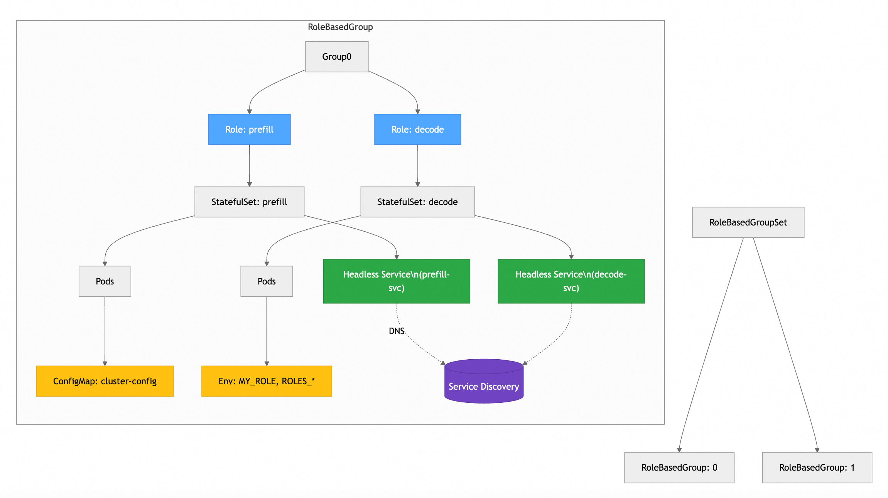

# The RoleBasedGroupSet API 

RoleBasedGroupSet: An API for for orchestrating distributed workload services with multi-role collaboration and automated service discovery.

## 📖 Overview

### Background
Traditional Kubernetes statefulset struggle with multi-role coordination in distributed stateful service scenarios. This solution addresses:
- Startup order dependencies between roles
- Complex cross-role service discovery
- Fragmented configuration management

### 🧩 Key Features
   **Multi-template Role Specification** - RoleBasedGroupSet models a distributed stateful workload as a group of K8s Workloads. This allows a user to easily specify different pod templates for different distinct groups of pods (e.g. a prefill, decode, scheduler, etc.), something which cannot be done by a single Statefulset.
✨ **Multi-Role Startup Sequencing** - Define role dependencies a startup order for the ReplicatedJobs in a RoleBasedGroupSet. This enables support for patterns like the “leader-worker” paradigm, where the leader must be running before the workers should start up and connect to it. 
🔍 **Auto Service Discovery** - applications discover peers via native DNS and pre-loaded YAML endpoints. Dynamic updates propagate through ConfigMap versioning without pod restarts. 
⚡ **Elastic Scaling** - Support group/role-level scaling flexible capacity management. Scale entire groups for capacity bursts (`spec.replicas`), adjust role replicas for workload balance. Built on StatefulSet controllers, scaling maintains stable network identities and ordered deployment semantics. 
📦 **Unified Configuration** - Dual injection via YAML and environment variables

## 🏗 Conceptual Diagram



## 🚀 Quick Start

### Install CRD
```bash
kubectl apply -f rolebasedgroupsets.yaml
```

### Minimal Example
```yaml
apiVersion: openpatio.io/v1alpha1
kind: RoleBasedGroupSet
metadata:
  name: demo-group
spec:
  replicas: 2
  groupTemplate:
    roles:
      - role: prefill
        replicas: 2
        template: { ... }
      - role: decode
        replicas: 2
        dependencies: ["prefill"]
        template: { ... }
```


## 📚 API Documentation

### Key Fields
| Field | Type | Description |
|-------|------|-------------|
| `startupPolicy` | string | Startup strategy (Ordered/Parallel) |
| `dependencies` | []string | Role dependencies list |
| `workload` | Object | Underlying workload type (default: StatefulSet) |

Full API spec: [API_REFERENCE.md](docs/API_REFERENCE.md)

## 🤝 Contributing
We welcome contributions through issues and PRs! See [CONTRIBUTING.md](CONTRIBUTING.md)

## Community, discussion, contribution, and support

Learn how to engage with the Kubernetes community on the [community page]().

You can reach the maintainers of this project at:

- [Slack]()
- [Mailing List]()

### Code of conduct

Participation in the Kubernetes community is governed by the [Kubernetes Code of Conduct](code-of-conduct.md).
